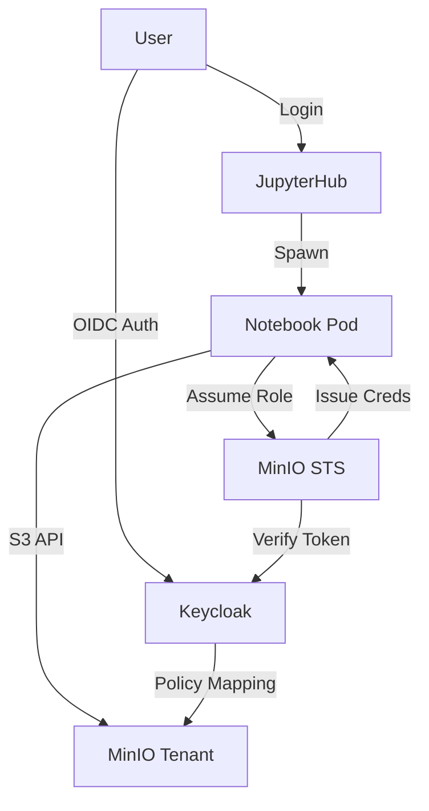

# Production Platform on GKE

A production-ready data platform deployed on Google Kubernetes Engine (GKE), integrating **JupyterHub**, **MinIO**, **Keycloak**, and **Vault**.

| Component | Purpose | Details |
|-----------|---------|---------|
| **JupyterHub** | Data Science Environment | Dynamic profiles (Small/Large/GPU), RBAC |
| **MinIO** | Object Storage (S3) | High-performance, OIDC-integrated, Multi-tenant |
| **Keycloak** | Identity & Access (IAM) | OIDC Provider, User Federation, RBAC |
| **Vault** | Secret Management | Centralized secret storage, OIDC auth |

## 🚀 Quick Start (GKE)

### 1. Prerequisites
- GKE Cluster (Standard or Autopilot)
- `kubectl` configured for the cluster
- `helm` installed
- `jq` installed

**Setup Cluster Context:**
```bash
gcloud container clusters get-credentials data-cluster-gke1 --zone europe-central2-b
```

### 2. Full Deployment
Run the automated deployment scripts in order:

```bash
# 1. Deploy Core Infrastructure (Keycloak & Vault)
./scripts/deploy-gke.sh

# 2. Deploy MinIO Tenant (S3 Storage)
./scripts/deploy-minio-gke.sh

# 3. Deploy JupyterHub (Data Science Environment)
./scripts/deploy-jupyterhub-gke.sh
```

### 3. Access Services

| Service | Local URL (after port-forward) | Default Creds |
|---------|--------------------------------|---------------|
| **JupyterHub** | http://localhost:8000 | Login via Keycloak |
| **Keycloak** | http://localhost:8080 | `admin` / `admin` (Vault Realm) |
| **MinIO Console** | http://localhost:9091 | Login via OIDC |
| **Vault** | http://localhost:8200 | Token in `config/vault-keys.json` |

---

## 🏗️ Architecture



### Integration Flow
1. **Authentication**: User logs into JupyterHub via Keycloak.
2. **Identity**: Keycloak issues an ID Token with user groups (e.g., `data-science`).
3. **Storage Access**: JupyterHub hooks exchange this ID Token for temporary **MinIO STS Credentials**.
4. **Notebook**: The Notebook pod starts with `AWS_ACCESS_KEY_ID`, `AWS_SECRET_ACCESS_KEY`, and `S3_ENDPOINT` injected.
5. **Authorization**: MinIO applies policies based on Keycloak groups (e.g., `data-science` group -> `data-science` policy).

---

## 🔒 Configuration & RBAC

### Keycloak (Declarative)
Configuration is managed via the **Keycloak Realm CRD** (`helm/keycloak/manifests/keycloak-realm-import.yaml`).
- **Users**: `admin`, `jupyter-admin`, `jupyter-ds`
- **Groups**: `admin`, `data-science`, `vault-admins`

### MinIO Policies (Scripted)
Policies are applied automatically by `deploy-minio-gke.sh`:
- **data-science**: Full S3 access to all buckets.
- **admin**: Full System Access.

### JupyterHub Profiles
Machine profiles are dynamically available based on group membership:
- **Small** (0.5 CPU, 1G RAM): Everyone
- **Large** (2 CPU, 4G RAM): `data-science` group
- **GPU** (4 CPU, 8G RAM): `gpu-users` group

---

## 📂 Project Structure

```
├── helm/
│   ├── jupyterhub/    # JupyterHub Chart & Values
│   ├── keycloak/      # Keycloak Operator & Manifests
│   ├── minio/         # MinIO Operator & Tenant Config
│   └── vault/         # Vault Helm Config
├── scripts/
│   ├── deploy-gke.sh              # Core Deployment
│   ├── deploy-minio-gke.sh        # MinIO Deployment
│   ├── deploy-jupyterhub-gke.sh   # JupyterHub Deployment
│   └── lib/                       # Shared Bash Functions
└── README-MINIKUBE.md             # Local Development Guide
```

## 🛠️ Local Development

For deployment on **Minikube**, please refer to:
👉 **[README-MINIKUBE.md](README-MINIKUBE.md)**

---

## License
Reference implementation for Data Platform deployment.
