# Data Platform on GKE

A data platform deployed on Google Kubernetes Engine (GKE) with centralized identity management, secrets management, object storage, distributed computing, and SQL analytics.

```mermaid
graph LR
    subgraph Platform
        KC[🔐 Keycloak] --> Vault[🔑 Vault]
        KC --> MinIO[📦 MinIO]
        KC --> JH[📓 JupyterHub]
        KC --> Dremio[🔍 Dremio]
        
        JH -->|STS| MinIO
        Spark[⚡ Spark] -->|S3A| MinIO
        Dremio -->|S3| MinIO
    end
```



## Components

| Component | Purpose | Namespace |
|-----------|---------|-----------|
| **Keycloak** | Identity Provider (OIDC/OAuth) | `operators` |
| **Vault** | Secrets Management | `vault` |
| **MinIO** | S3-Compatible Object Storage | `minio` |
| **JupyterHub** | Interactive Notebooks | `jupyterhub` |
| **Spark Operator** | Distributed Computing | `operators` |
| **Dremio** | SQL Analytics Engine | `dremio` |

---

## Quick Start

### Prerequisites

- GKE Cluster with `kubectl` configured
- `helm` and `jq` installed

### Connect to Cluster

```bash
gcloud container clusters get-credentials <cluster-name> --zone <zone> --project <project>
```

### Deploy Platform

```bash
# 1. Core Infrastructure (Keycloak + Vault)
./scripts/deploy-gke.sh

# 2. Object Storage (MinIO)
./scripts/deploy-minio-gke.sh

# 3. Notebooks (JupyterHub)
./scripts/deploy-jupyterhub-gke.sh

# 4. Distributed Computing (Spark)
./scripts/deploy-spark-operator.sh

# 5. SQL Analytics (Dremio) - Optional
./scripts/deploy-dremio-ee.sh
```

### Access Services

```bash
./scripts/start-port-forwards.sh
```

| Service | URL | Login |
|---------|-----|-------|
| Keycloak | http://localhost:8080 | `admin` / `admin` |
| Vault | http://localhost:8200 | OIDC or Token |
| MinIO | https://localhost:9091 | "Login with OpenID" |
| JupyterHub | http://localhost:8000 | "Sign in with Keycloak" |
| Dremio | http://localhost:9047 | (when deployed) |

---

## Architecture

```mermaid
graph TB
    User[👤 User] -->|OIDC| KC[Keycloak]
    
    KC -->|Auth| Vault
    KC -->|Auth| MinIO
    KC -->|OAuth| JH[JupyterHub]
    KC -->|Auth| Dremio
    
    JH -->|STS Credentials| MinIO
    Spark -->|S3A| MinIO
    Dremio -->|S3| MinIO
    
    subgraph "Data Processing"
        JH
        Spark[Spark Jobs]
        Dremio
    end
    
    subgraph "Data Lake"
        MinIO
    end
```



### Authentication Flow

1. **User** authenticates with **Keycloak** (OIDC)
2. **Keycloak** issues ID Token with user groups
3. **Services** validate tokens and apply group-based policies
4. **MinIO STS** provides temporary S3 credentials

### Data Flow

- **JupyterHub**: Auto-injects MinIO STS credentials into notebooks
- **Spark**: Uses S3A connector with MinIO credentials
- **Dremio**: Queries data directly from MinIO buckets

---

## Project Structure

```
├── docs/
│   ├── ARCHITECTURE.md    # Detailed architecture diagrams
│   ├── ACCESS.md          # Credentials and access control
│   ├── DEPLOYMENT.md      # Step-by-step deployment guide
│   ├── JUPYTERHUB.md      # JupyterHub OAuth configuration
│   ├── MINIO_STS.md       # MinIO STS credentials guide
│   └── VAULT_OIDC.md      # Vault OIDC login guide
├── helm/
│   ├── keycloak/          # Keycloak operator & manifests
│   ├── vault/             # Vault Helm values
│   ├── minio/             # MinIO operator & tenant config
│   ├── jupyterhub/        # JupyterHub Helm values
│   ├── spark/             # Spark operator chart
│   └── dremio/            # Dremio Helm chart
├── scripts/
│   ├── deploy-gke.sh              # Deploy Keycloak + Vault
│   ├── deploy-minio-gke.sh        # Deploy MinIO
│   ├── deploy-jupyterhub-gke.sh   # Deploy JupyterHub
│   ├── deploy-spark-operator.sh   # Deploy Spark Operator
│   ├── deploy-dremio-ee.sh        # Deploy Dremio
│   ├── start-port-forwards.sh     # Start all port forwards
│   ├── show-access-info.sh        # Display credentials
│   ├── list-users.sh              # List Keycloak users
│   └── cleanup-dremio-namespace.sh # Clean stuck namespaces
└── config/                # Generated credentials (gitignored)
```

---

## Documentation

| Document | Description |
|----------|-------------|
| [ARCHITECTURE.md](docs/ARCHITECTURE.md) | Component details, data flows, Mermaid diagrams |
| [ACCESS.md](docs/ACCESS.md) | All credentials, auth methods, policies |
| [DEPLOYMENT.md](docs/DEPLOYMENT.md) | Complete GKE deployment guide |
| [JUPYTERHUB.md](docs/JUPYTERHUB.md) | JupyterHub OAuth configuration |
| [MINIO_STS.md](docs/MINIO_STS.md) | MinIO STS credential generation |
| [VAULT_OIDC.md](docs/VAULT_OIDC.md) | Vault OIDC login troubleshooting |

---

## Scripts Reference

| Script | Purpose |
|--------|---------|
| `deploy-gke.sh` | Deploy Keycloak + Vault with OIDC |
| `deploy-minio-gke.sh` | Deploy MinIO with OIDC + STS |
| `deploy-jupyterhub-gke.sh` | Deploy JupyterHub with OAuth |
| `deploy-spark-operator.sh` | Deploy Spark Operator |
| `deploy-dremio-ee.sh` | Deploy Dremio Enterprise |
| `start-port-forwards.sh` | Start all port forwards |
| `show-access-info.sh` | Display all credentials |
| `list-users.sh` | List Keycloak users |
| `list-policies.sh` | List MinIO policies |
| `get-minio-sts-credentials.sh` | Get MinIO STS tokens |
| `cleanup-dremio-namespace.sh` | Clean stuck namespaces |

---

## Quick Commands

```bash
# Get all credentials
./scripts/show-access-info.sh

# Start port forwards
./scripts/start-port-forwards.sh

# List users
./scripts/list-users.sh

# Get MinIO STS credentials
./scripts/get-minio-sts-credentials.sh

# Check pods
kubectl get pods -A | grep -E '^(operators|vault|minio|jupyterhub|dremio)'
```

---

## License

Reference implementation for Data Platform deployment.
