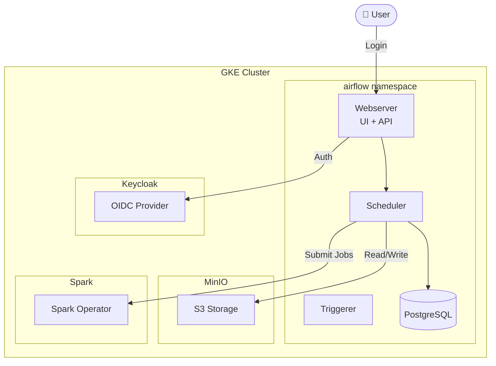
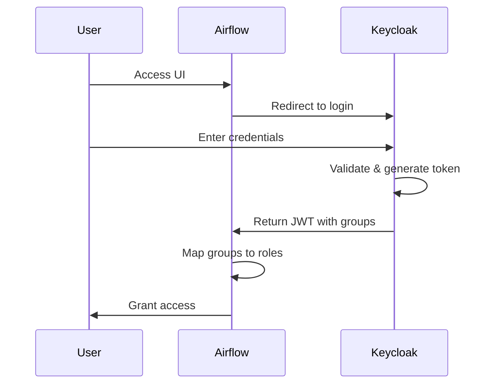

# Airflow Integration Guide

This document describes the Apache Airflow deployment and its integration with the data platform.

## Overview

Apache Airflow is deployed as a workflow orchestration tool for scheduling and monitoring data pipelines. It integrates with:

- **Keycloak** for authentication via the Keycloak Auth Manager
- **MinIO** for S3-compatible data storage (via operators)
- **Spark** for distributed data processing (via SparkKubernetesOperator)

## Architecture



## Authentication Flow

1. User accesses Airflow UI at `http://localhost:8085`
2. Airflow redirects to Keycloak login page
3. User authenticates with Keycloak credentials
4. Keycloak issues JWT token with group claims
5. Airflow validates token and maps groups to roles
6. User gets appropriate access based on their role



## Role-Based Access Control

### Keycloak Groups → Airflow Roles

| Keycloak Group | Airflow Role | Description |
|----------------|--------------|-------------|
| `airflow-admin` | Admin | Full administrative access |
| `data-engineers` | Editor | Create and execute DAGs |
| `data-scientists` | Viewer | Read-only access |

### Permission Matrix

| Permission | Admin | Editor | Viewer |
|------------|-------|--------|--------|
| View DAGs | ✅ | ✅ | ✅ |
| Trigger DAGs | ✅ | ✅ | ❌ |
| Edit DAGs | ✅ | ✅ | ❌ |
| View Logs | ✅ | ✅ | ✅ |
| Admin Settings | ✅ | ❌ | ❌ |
| Manage Users | ✅ | ❌ | ❌ |
| Manage Connections | ✅ | ✅ | ❌ |
| Manage Variables | ✅ | ✅ | ❌ |

### User Assignments

| User | Password | Groups | Airflow Role |
|------|----------|--------|--------------|
| `admin` | admin | airflow-admin, admin | Admin |
| `jupyter-admin` | password123 | data-engineers | Editor |
| `jupyter-ds` | password123 | data-scientists | Viewer |

## Deployment

### Prerequisites

- Keycloak running and accessible
- GKE cluster with sufficient resources

### Deploy Airflow

```bash
./scripts/deploy-airflow-gke.sh
```

### Initialize Permissions

After deployment, initialize Keycloak permissions:

```bash
kubectl exec -it deploy/airflow-webserver -n airflow -- \
  airflow keycloak-auth-manager create-all \
    --username admin \
    --password admin \
    --user-realm vault
```

## Configuration

### Keycloak Client Settings

The Airflow client in Keycloak is configured with:

```yaml
clientId: airflow
secret: airflow-secret
standardFlowEnabled: true
directAccessGrantsEnabled: true
serviceAccountsEnabled: true
authorizationServicesEnabled: true
redirectUris:
  - "http://localhost:8085/*"
```

### Airflow Configuration

Key environment variables:

| Variable | Value |
|----------|-------|
| `AIRFLOW__CORE__AUTH_MANAGER` | `airflow.providers.keycloak...KeycloakAuthManager` |
| `AIRFLOW__KEYCLOAK_AUTH_MANAGER__CLIENT_ID` | `airflow` |
| `AIRFLOW__KEYCLOAK_AUTH_MANAGER__REALM` | `vault` |
| `AIRFLOW__KEYCLOAK_AUTH_MANAGER__SERVER_URL` | `http://keycloak-service.operators.svc.cluster.local:8080` |

## Example DAGs

### MinIO Data Pipeline

```python
from airflow import DAG
from airflow.providers.amazon.aws.operators.s3 import S3CreateBucketOperator
from airflow.providers.amazon.aws.transfers.local_to_s3 import LocalFilesystemToS3Operator
from datetime import datetime

with DAG(
    'minio_data_pipeline',
    start_date=datetime(2024, 1, 1),
    schedule_interval='@daily',
) as dag:
    
    create_bucket = S3CreateBucketOperator(
        task_id='create_bucket',
        bucket_name='airflow-data',
        aws_conn_id='minio_default',
    )
    
    upload_file = LocalFilesystemToS3Operator(
        task_id='upload_file',
        filename='/tmp/data.csv',
        dest_key='raw/data.csv',
        dest_bucket='airflow-data',
        aws_conn_id='minio_default',
    )
    
    create_bucket >> upload_file
```

### Spark Job

```python
from airflow import DAG
from airflow.providers.cncf.kubernetes.operators.spark_kubernetes import SparkKubernetesOperator
from datetime import datetime

with DAG(
    'spark_etl_job',
    start_date=datetime(2024, 1, 1),
    schedule_interval='@daily',
) as dag:
    
    spark_job = SparkKubernetesOperator(
        task_id='run_spark_etl',
        namespace='operators',
        application_file='spark-app.yaml',
        kubernetes_conn_id='kubernetes_default',
    )
```

## Connections

### MinIO Connection

Create a connection for MinIO:

```bash
kubectl exec -it deploy/airflow-webserver -n airflow -- \
  airflow connections add minio_default \
    --conn-type aws \
    --conn-extra '{"endpoint_url": "https://minio.minio.svc.cluster.local", "aws_access_key_id": "xxx", "aws_secret_access_key": "xxx"}'
```

## Access URLs

| Service | Local URL | Port Forward |
|---------|-----------|--------------|
| Airflow UI | http://localhost:8085 | `kubectl port-forward svc/airflow-webserver -n airflow 8085:8080` |
| Keycloak | http://localhost:8080 | `kubectl port-forward svc/keycloak-service -n operators 8080:8080` |

## Troubleshooting

### Authentication Issues

1. **Check Keycloak connectivity:**
   ```bash
   kubectl exec -it deploy/airflow-webserver -n airflow -- \
     curl http://keycloak-service.operators.svc.cluster.local:8080/realms/vault
   ```

2. **Verify client secret:**
   ```bash
   kubectl get secret airflow-keycloak-secret -n airflow -o jsonpath='{.data.client-secret}' | base64 -d
   ```

3. **Check Airflow logs:**
   ```bash
   kubectl logs deploy/airflow-webserver -n airflow | grep -i keycloak
   ```

### Permission Issues

1. **Verify user groups in Keycloak:**
   - Access Keycloak admin at http://localhost:8080
   - Navigate to Users → Select user → Groups tab

2. **Re-initialize permissions:**
   ```bash
   kubectl exec -it deploy/airflow-webserver -n airflow -- \
     airflow keycloak-auth-manager create-all \
       --username admin --password admin --user-realm vault
   ```

## References

- [Keycloak Auth Manager Documentation](https://airflow.apache.org/docs/apache-airflow-providers-keycloak/stable/auth-manager/index.html)
- [Airflow Helm Chart](https://airflow.apache.org/docs/helm-chart/stable/index.html)
- [SparkKubernetesOperator](https://airflow.apache.org/docs/apache-airflow-providers-cncf-kubernetes/stable/operators.html)
