# Airflow Integration Guide

This document describes the Apache Airflow deployment and its integration with the data platform.

## Overview

Apache Airflow is deployed as a workflow orchestration tool for scheduling and monitoring data pipelines. It integrates with:

- **Keycloak** for authentication via the Keycloak Auth Manager
- **MinIO** for S3-compatible data storage (via operators)
- **Spark** for distributed data processing (via SparkKubernetesOperator)

## Architecture

```mermaid
graph TB
    subgraph GKE["GKE Cluster"]
        subgraph AirflowNS["airflow namespace"]
            Web[Webserver<br/>UI + API]
            Sched[Scheduler]
            Trig[Triggerer]
            PG[(PostgreSQL)]
        end
        
        subgraph KC["Keycloak"]
            OIDC[OIDC Provider]
        end
        
        subgraph MinIONS["MinIO"]
            S3[S3 Storage]
        end
        
        subgraph SparkNS["Spark"]
            SparkOp[Spark Operator]
        end
    end
    
    User([👤 User]) -->|Login| Web
    Web -->|Auth| OIDC
    Web --> Sched
    Sched --> PG
    Sched -->|Submit Jobs| SparkOp
    Sched -->|Read/Write| S3
```



## Authentication Flow

1. User accesses Airflow UI at `http://localhost:8085`
2. Airflow redirects to Keycloak login page
3. User authenticates with Keycloak credentials
4. Keycloak issues JWT token with group claims
5. Airflow validates token and maps groups to roles
6. User gets appropriate access based on their role


## Role-Based Access Control

### Keycloak Groups → Airflow Roles

| Keycloak Group | Airflow Role | Description |
|----------------|--------------|-------------|
| `airflow-admin` | Admin | Full administrative access |
| `data-engineers` | Editor | Create and execute DAGs |
| `data-scientists` | Viewer | Read-only access |

### Permission Matrix

| Permission | Admin | Editor | Viewer |
|------------|-------|--------|--------|
| View DAGs | ✅ | ✅ | ✅ |
| Trigger DAGs | ✅ | ✅ | ❌ |
| Edit DAGs | ✅ | ✅ | ❌ |
| View Logs | ✅ | ✅ | ✅ |
| Admin Settings | ✅ | ❌ | ❌ |
| Manage Users | ✅ | ❌ | ❌ |
| Manage Connections | ✅ | ✅ | ❌ |
| Manage Variables | ✅ | ✅ | ❌ |

### User Assignments

| User | Password | Groups | Access Level |
|------|----------|--------|--------------|
| `admin` | admin | airflow-admin, admin | Admin (full access) |
| `jupyter-admin` | jupyter-admin | data-engineers | User (editor) |
| `jupyter-ds` | jupyter-ds | data-scientists | ReadOnly (viewer) |

## Deployment

### Prerequisites

- Keycloak running and accessible
- GKE cluster with sufficient resources

### Deploy Airflow

```bash
./scripts/deploy-airflow-gke.sh
```

The deployment script automatically:
1. Creates the Airflow Keycloak client with authorization services enabled
2. Creates Keycloak groups (`airflow-admin`, `data-engineers`, `data-scientists`)
3. Deploys Airflow with hostAliases for Keycloak connectivity
4. Creates MinIO bucket for remote logging
5. Initializes Keycloak authorization scopes, resources, and permissions
6. **Configures group policies linking Keycloak groups to Airflow permissions**

## Keycloak Authorization Setup

The Airflow Keycloak Auth Manager uses Keycloak's **Authorization Services** for fine-grained access control. This requires a multi-step configuration:

### Authorization Architecture


### Step 1: Scopes (Created by Airflow CLI)

Scopes define the types of operations that can be performed:

| Scope | Description |
|-------|-------------|
| `GET` | Read/view resources |
| `POST` | Create new resources |
| `PUT` | Update existing resources |
| `DELETE` | Remove resources |
| `MENU` | Access menu items |
| `LIST` | List/enumerate resources |

### Step 2: Resources (Created by Airflow CLI)

Resources represent Airflow entities that can be protected:

- `Dag` - DAG definitions and runs
- `Connection` - Database/API connections
- `Variable` - Airflow variables
- `Pool` - Worker pools
- `Configuration` - Airflow config
- `Asset` - Data assets
- `Backfill` - Backfill operations
- Menu items (Assets, Connections, Dags, etc.)

### Step 3: Permissions (Created by Airflow CLI)

Permissions combine resources and scopes:

| Permission | Type | Description |
|------------|------|-------------|
| `Admin` | scope-based | Full access to all scopes |
| `User` | resource-based | Standard user access |
| `ReadOnly` | scope-based | Read-only access (GET, LIST, MENU) |
| `Op` | resource-based | Operations access |

### Step 4: Group Policies (Created by Deploy Script)

Group policies link Keycloak groups to permissions. **This is the critical step** that the deployment script performs via the Keycloak Admin REST API:

```
┌─────────────────────┬────────────────────────────┬──────────────┬─────────────────────────────┐
│ Keycloak Group      │ Group Policy               │ Permission   │ Scopes                      │
├─────────────────────┼────────────────────────────┼──────────────┼─────────────────────────────┤
│ airflow-admin       │ airflow-admin-group-policy │ Admin        │ GET,POST,PUT,DELETE,MENU,LIST│
│ data-engineers      │ data-engineers-group-policy│ User         │ GET,POST,PUT,DELETE,MENU,LIST│
│ data-scientists     │ data-scientists-group-policy│ ReadOnly    │ GET,LIST,MENU               │
└─────────────────────┴────────────────────────────┴──────────────┴─────────────────────────────┘
```

### Step 5: Resource Server Decision Strategy (CRITICAL)

The Keycloak Authorization Server uses a **decision strategy** to determine access when multiple permissions are evaluated:

| Strategy | Behavior | Use Case |
|----------|----------|----------|
| `UNANIMOUS` | ALL permissions must PERMIT | High security, restrictive |
| `AFFIRMATIVE` | ANY permission can PERMIT | Flexible, role-based |
| `CONSENSUS` | Majority must PERMIT | Voting-based |

**⚠️ IMPORTANT:** The default is `UNANIMOUS`, which causes 403 errors when:
- User is in `airflow-admin` group → `Admin` permission = PERMIT
- User is NOT in `data-scientists` group → `ReadOnly` permission = DENY
- Result: **DENY** (because not all permissions permit)

The deployment script sets this to `AFFIRMATIVE`, so users get access if **any** of their group's permissions grant it.

```bash
# Set resource server decision strategy (done by deployment script)
curl -X PUT "http://localhost:8080/admin/realms/vault/clients/${CLIENT_UUID}/authz/resource-server" \
  -H "Authorization: Bearer $TOKEN" \
  -H "Content-Type: application/json" \
  -d '{
    "decisionStrategy": "AFFIRMATIVE"
  }'
```

### Manual Authorization Setup

If automatic setup fails, configure manually:

```bash
# Step 1: Create scopes, resources, and permissions (via Airflow CLI)
MASTER_USER=$(kubectl get secret keycloak-initial-admin -n operators -o jsonpath='{.data.username}' | base64 -d)
MASTER_PASS=$(kubectl get secret keycloak-initial-admin -n operators -o jsonpath='{.data.password}' | base64 -d)

kubectl exec -it deploy/airflow-api-server -n airflow -- \
  airflow keycloak-auth-manager create-all \
    --username "$MASTER_USER" \
    --password "$MASTER_PASS" \
    --user-realm master

# Step 2: Configure group policies (via Keycloak Admin API)
# Get admin token
TOKEN=$(curl -s -X POST 'http://localhost:8080/realms/master/protocol/openid-connect/token' \
  -d 'client_id=admin-cli' \
  -d "username=$MASTER_USER" \
  -d "password=$MASTER_PASS" \
  -d 'grant_type=password' | jq -r '.access_token')

# Get Airflow client UUID
CLIENT_UUID=$(curl -s "http://localhost:8080/admin/realms/vault/clients" \
  -H "Authorization: Bearer $TOKEN" | jq -r '.[] | select(.clientId=="airflow") | .id')

# Get airflow-admin group ID
GROUP_ID=$(curl -s "http://localhost:8080/admin/realms/vault/groups" \
  -H "Authorization: Bearer $TOKEN" | jq -r '.[] | select(.name=="airflow-admin") | .id')

# Create group policy
curl -X POST "http://localhost:8080/admin/realms/vault/clients/${CLIENT_UUID}/authz/resource-server/policy/group" \
  -H "Authorization: Bearer $TOKEN" \
  -H "Content-Type: application/json" \
  -d "{
    \"name\": \"airflow-admin-group-policy\",
    \"groups\": [{\"id\": \"${GROUP_ID}\", \"extendChildren\": false}],
    \"logic\": \"POSITIVE\",
    \"groupsClaim\": \"groups\"
  }"

# Repeat for data-engineers and data-scientists groups...
```

## Configuration

### Keycloak Client Settings

The Airflow client in Keycloak is configured with:

```yaml
clientId: airflow
secret: airflow-secret
standardFlowEnabled: true
directAccessGrantsEnabled: true
serviceAccountsEnabled: true
authorizationServicesEnabled: true
redirectUris:
  - "http://localhost:8085/*"
```

### Airflow Configuration

Key environment variables configured in [values.yaml](../helm/airflow/values.yaml):

| Variable | Value | Description |
|----------|-------|-------------|
| `AIRFLOW__CORE__AUTH_MANAGER` | `airflow.providers.keycloak...KeycloakAuthManager` | Use Keycloak for authentication |
| `AIRFLOW__KEYCLOAK_AUTH_MANAGER__CLIENT_ID` | `airflow` | Keycloak client ID |
| `AIRFLOW__KEYCLOAK_AUTH_MANAGER__CLIENT_SECRET` | (from secret) | Client secret for token exchange |
| `AIRFLOW__KEYCLOAK_AUTH_MANAGER__REALM` | `vault` | Keycloak realm name |
| `AIRFLOW__KEYCLOAK_AUTH_MANAGER__SERVER_URL` | `http://keycloak.local:8080` | Keycloak server URL |
| `AIRFLOW__WEBSERVER__BASE_URL` | `http://localhost:8085` | Airflow base URL for redirects |
| `AIRFLOW__WEBSERVER__SESSION_LIFETIME_MINUTES` | `30` | Browser session lifetime |

## Session & Token Configuration

### Token Lifespans (Keycloak Realm)

To prevent frequent 500 errors due to token expiry, the deployment script configures extended token lifespans:

| Setting | Default | Configured | Description |
|---------|---------|------------|-------------|
| `accessTokenLifespan` | 300s (5min) | 3600s (1hr) | How long access tokens are valid |
| `ssoSessionIdleTimeout` | 1800s (30min) | 7200s (2hr) | Session timeout when idle |
| `ssoSessionMaxLifespan` | 36000s (10hr) | 86400s (24hr) | Maximum session duration |

**Why These Settings Matter:**

The Keycloak Auth Manager validates tokens on every request. If the token expires mid-session, users see a **500 Internal Server Error** instead of being redirected to login. Longer token lifespans reduce this friction.

**Configuration Location:**

1. **Runtime** - Set via Keycloak Admin API (done by deployment script):
   ```bash
   curl -X PUT "http://localhost:8080/admin/realms/vault" \
     -H "Authorization: Bearer $TOKEN" \
     -d '{"accessTokenLifespan": 3600, "ssoSessionIdleTimeout": 7200, "ssoSessionMaxLifespan": 86400}'
   ```

2. **Realm Import** - Configured in [keycloak-realm-import.yaml](../helm/keycloak/manifests/keycloak-realm-import.yaml):
   ```yaml
   realm:
     accessTokenLifespan: 3600
     ssoSessionIdleTimeout: 7200
     ssoSessionMaxLifespan: 86400
   ```

### Session Handling

| Component | Session Storage | Lifetime |
|-----------|-----------------|----------|
| Keycloak SSO | Server-side | 24 hours max |
| Airflow Browser | Cookie | 30 minutes |
| Access Token | JWT (stateless) | 1 hour |
| Refresh Token | Server-side | 30 days |

**Troubleshooting Token Expiry:**

| Symptom | Cause | Solution |
|---------|-------|----------|
| 500 error after idle | Access token expired | Clear cookies, re-login |
| 401 Invalid bearer token | Token validation failed | Check Keycloak connectivity |
| Redirect loop | Session cookie invalid | Clear all cookies for both domains |

### Host Aliases Configuration

Since Airflow pods need to communicate with Keycloak using a consistent hostname (`keycloak.local`), the deployment script dynamically configures `hostAliases` for each Airflow component. This adds an entry to `/etc/hosts` in each pod to resolve `keycloak.local` to the Keycloak service ClusterIP.

**Why Host Aliases?**

- The Keycloak Auth Manager validates JWT tokens by contacting the Keycloak server
- Using `keycloak.local` allows consistent URLs in both Airflow config and browser redirects
- The ClusterIP is fetched dynamically at deployment time

**Configured Components:**

| Component | Purpose |
|-----------|---------|
| `apiServer` | API server (Airflow 3.0) needs to validate auth tokens |
| `scheduler` | Scheduler may need to validate tokens for API calls |
| `triggerer` | Triggerer for async task execution |
| `dagProcessor` | DAG processor for parsing DAG files |

**Deployment Script Configuration:**

The [deploy script](../scripts/lib/airflow-common.sh) dynamically sets host aliases:

```bash
# Get Keycloak ClusterIP dynamically
KEYCLOAK_CLUSTER_IP=$(kubectl get svc keycloak-service -n operators -o jsonpath='{.spec.clusterIP}')

# Set hostAliases for each component
helm install airflow apache-airflow/airflow \
  --set "apiServer.hostAliases[0].ip=${KEYCLOAK_CLUSTER_IP}" \
  --set "apiServer.hostAliases[0].hostnames[0]=keycloak.local" \
  --set "scheduler.hostAliases[0].ip=${KEYCLOAK_CLUSTER_IP}" \
  --set "scheduler.hostAliases[0].hostnames[0]=keycloak.local" \
  # ... same for triggerer and dagProcessor
```

**Verifying Host Aliases:**

```bash
# Check /etc/hosts in a pod
kubectl exec -it deploy/airflow-scheduler -n airflow -- cat /etc/hosts

# Should show:
# 34.118.231.20   keycloak.local
```

**Note:** These values are passed via `--set` flags during Helm install/upgrade, not in `values.yaml`, because the ClusterIP is determined at deployment time.

### Local Development (WSL/Windows)

When accessing Airflow from a browser on Windows (while running kubectl from WSL), you also need to add `keycloak.local` to the **Windows hosts file**. This is because:

1. Airflow UI (localhost:8085) redirects to `keycloak.local:8080` for authentication
2. Your browser runs on Windows, not inside WSL or Kubernetes
3. Windows needs to resolve `keycloak.local` to reach the port-forwarded Keycloak service

**Windows Hosts File Setup:**

Edit `C:\Windows\System32\drivers\etc\hosts` (as Administrator):

```
127.0.0.1  keycloak.local
```

**Required Port Forwards:**

```bash
# Keycloak (for browser authentication)
kubectl port-forward svc/keycloak-service -n operators 8080:8080 --address 0.0.0.0

# Airflow (for UI access)
kubectl port-forward -n airflow svc/airflow-api-server 8085:8080
```

**Authentication Flow:**

```mermaid
sequenceDiagram
    participant Browser as Windows Browser
    participant Airflow as Airflow (localhost:8085)
    participant Keycloak as Keycloak (keycloak.local:8080)
    
    Browser->>Airflow: Access http://localhost:8085
    Airflow->>Browser: Redirect to keycloak.local:8080/auth
    Note over Browser: Windows resolves keycloak.local → 127.0.0.1
    Browser->>Keycloak: Login page (via port-forward)
    Keycloak->>Browser: Return JWT token
    Browser->>Airflow: Access with token
    Note over Airflow: Pod resolves keycloak.local via hostAliases
    Airflow->>Keycloak: Validate token (internal cluster)
    Airflow->>Browser: Authenticated response
```



**Troubleshooting:**

| Issue | Solution |
|-------|----------|
| "keycloak.local" not reachable | Add to Windows hosts file and ensure port-forward is running |
| Login page shows but redirect fails | Check Keycloak client redirect URIs include `http://localhost:8085/*` |
| Token validation fails | Verify hostAliases are set in Airflow pods |

## Example DAGs

### MinIO Data Pipeline

```python
from airflow import DAG
from airflow.providers.amazon.aws.operators.s3 import S3CreateBucketOperator
from airflow.providers.amazon.aws.transfers.local_to_s3 import LocalFilesystemToS3Operator
from datetime import datetime

with DAG(
    'minio_data_pipeline',
    start_date=datetime(2024, 1, 1),
    schedule_interval='@daily',
) as dag:
    
    create_bucket = S3CreateBucketOperator(
        task_id='create_bucket',
        bucket_name='airflow-data',
        aws_conn_id='minio_default',
    )
    
    upload_file = LocalFilesystemToS3Operator(
        task_id='upload_file',
        filename='/tmp/data.csv',
        dest_key='raw/data.csv',
        dest_bucket='airflow-data',
        aws_conn_id='minio_default',
    )
    
    create_bucket >> upload_file
```

### Spark Job

```python
from airflow import DAG
from airflow.providers.cncf.kubernetes.operators.spark_kubernetes import SparkKubernetesOperator
from datetime import datetime

with DAG(
    'spark_etl_job',
    start_date=datetime(2024, 1, 1),
    schedule_interval='@daily',
) as dag:
    
    spark_job = SparkKubernetesOperator(
        task_id='run_spark_etl',
        namespace='operators',
        application_file='spark-app.yaml',
        kubernetes_conn_id='kubernetes_default',
    )
```

## Connections

### MinIO Connection

Create a connection for MinIO:

```bash
kubectl exec -it deploy/airflow-webserver -n airflow -- \
  airflow connections add minio_default \
    --conn-type aws \
    --conn-extra '{"endpoint_url": "https://minio.minio.svc.cluster.local", "aws_access_key_id": "xxx", "aws_secret_access_key": "xxx"}'
```

## Access URLs

| Service | Local URL | Port Forward |
|---------|-----------|--------------|
| Airflow UI | http://localhost:8085 | `kubectl port-forward svc/airflow-webserver -n airflow 8085:8080` |
| Keycloak | http://localhost:8080 | `kubectl port-forward svc/keycloak-service -n operators 8080:8080` |

## Troubleshooting

### Authentication Issues

1. **Check Keycloak connectivity:**
   ```bash
   kubectl exec -it deploy/airflow-webserver -n airflow -- \
     curl http://keycloak-service.operators.svc.cluster.local:8080/realms/vault
   ```

2. **Verify client secret:**
   ```bash
   kubectl get secret airflow-keycloak-secret -n airflow -o jsonpath='{.data.client-secret}' | base64 -d
   ```

3. **Check Airflow logs:**
   ```bash
   kubectl logs deploy/airflow-webserver -n airflow | grep -i keycloak
   ```

### Permission Issues

1. **Verify user groups in Keycloak:**
   - Access Keycloak admin at http://localhost:8080
   - Navigate to Users → Select user → Groups tab

2. **Re-initialize permissions:**
   ```bash
   kubectl exec -it deploy/airflow-webserver -n airflow -- \
     airflow keycloak-auth-manager create-all \
       --username admin --password admin --user-realm vault
   ```

## Known Limitations

### Logout Button Returns 401 (TODO)

**Issue:** The Airflow logout button (`/auth/logout`) returns "Not authenticated" (401) when clicked, instead of properly redirecting to Keycloak's logout endpoint.

**Root Cause:** The Keycloak Auth Manager's logout route requires a valid session (`Depends(get_user)`) to retrieve the `id_token` for the OIDC logout flow. When the session is expired or invalid, it returns 401 instead of gracefully redirecting to Keycloak.

**Workaround:** Use the direct Keycloak logout URL:
```
http://keycloak:8080/realms/vault/protocol/openid-connect/logout?client_id=airflow&post_logout_redirect_uri=http://localhost:8085/
```

**TODO:** Submit a feature request/PR to Apache Airflow Keycloak provider to handle unauthenticated logout requests by redirecting directly to Keycloak's `end_session_endpoint`.

**Proposed Fix:**
```python
# Current code in login.py:
@login_router.get("/logout")
def logout(request: Request, user: Annotated[KeycloakAuthManagerUser, Depends(get_user)]):
    # Requires valid session

# Should be changed to:
@login_router.get("/logout")
def logout(request: Request, user: Annotated[KeycloakAuthManagerUser | None, Depends(get_user_optional)]):
    if user is None:
        # Redirect directly to Keycloak logout without id_token_hint
        return RedirectResponse(f"{end_session_endpoint}?client_id=airflow&post_logout_redirect_uri={redirect_uri}")
```

## References

- [Keycloak Auth Manager Documentation](https://airflow.apache.org/docs/apache-airflow-providers-keycloak/stable/auth-manager/index.html)
- [Airflow Helm Chart](https://airflow.apache.org/docs/helm-chart/stable/index.html)
- [SparkKubernetesOperator](https://airflow.apache.org/docs/apache-airflow-providers-cncf-kubernetes/stable/operators.html)

---

## Appendix: Complete Configuration Reference

### A. Keycloak Groups

| Group | Purpose | Linked Permission |
|-------|---------|-------------------|
| `airflow-admin` | Full administrative access | Admin |
| `data-engineers` | DAG development and execution | User |
| `data-scientists` | Read-only viewing | ReadOnly |

### B. Authorization Scopes

| Scope | HTTP Method | Operations |
|-------|-------------|------------|
| `GET` | GET | View single resource |
| `LIST` | GET | List multiple resources |
| `POST` | POST | Create new resource |
| `PUT` | PUT/PATCH | Update existing resource |
| `DELETE` | DELETE | Remove resource |
| `MENU` | - | Access UI menu items |

### C. Authorization Resources

Resources created by `airflow keycloak-auth-manager create-all`:

| Resource | Description | Common Scopes |
|----------|-------------|---------------|
| `Dag` | Individual DAG | GET, POST, PUT, DELETE, LIST |
| `Dags` | DAG collection | MENU |
| `Connection` | Single connection | GET, POST, PUT, DELETE |
| `Connections` | Connection collection | MENU, LIST |
| `Variable` | Single variable | GET, POST, PUT, DELETE |
| `Variables` | Variable collection | MENU, LIST |
| `Pool` | Worker pool | GET, POST, PUT, DELETE |
| `Pools` | Pool collection | MENU, LIST |
| `Configuration` | Airflow config | GET |
| `Config` | Config endpoint | GET, LIST |
| `Asset` | Data asset | GET, POST, PUT, DELETE |
| `Assets` | Asset collection | MENU |
| `AssetAlias` | Asset alias | GET, POST, PUT, DELETE |
| `Backfill` | Backfill job | GET, POST, PUT, DELETE |
| `View` | UI views | GET, LIST |
| `Menu` | Menu items | GET, MENU |
| `Docs` | Documentation | GET |
| `Plugins` | Plugins info | GET |
| `Providers` | Provider info | GET, LIST |
| `XComs` | XCom values | GET, LIST |
| `Audit Log` | Audit entries | GET, LIST |
| `Custom` | Custom endpoints | GET |

### D. Authorization Permissions

| Permission | Type | Scopes | Resources |
|------------|------|--------|-----------|
| `Admin` | scope-based | GET, POST, PUT, DELETE, LIST, MENU | All (22 resources) |
| `User` | resource-based | GET, POST, PUT, DELETE, LIST | Dag, Asset |
| `ReadOnly` | scope-based | GET, LIST, MENU | None (applies globally) |
| `Op` | resource-based | Various | Operational resources |

### E. Group Policies

| Policy Name | Group | Logic | Decision Strategy |
|-------------|-------|-------|-------------------|
| `airflow-admin-group-policy` | airflow-admin | POSITIVE | AFFIRMATIVE |
| `data-engineers-group-policy` | data-engineers | POSITIVE | AFFIRMATIVE |
| `data-scientists-group-policy` | data-scientists | POSITIVE | AFFIRMATIVE |

### F. Keycloak Client Configuration

```yaml
# Airflow client in Keycloak (vault realm)
clientId: airflow
name: Airflow
enabled: true
clientAuthenticatorType: client-secret
secret: airflow-secret
protocol: openid-connect

# Authentication flows
standardFlowEnabled: true          # Authorization code flow (browser)
directAccessGrantsEnabled: true    # Resource owner password (CLI)
serviceAccountsEnabled: true       # Client credentials (service)
implicitFlowEnabled: false         # Not needed

# Authorization services
authorizationServicesEnabled: true
authorizationSettings:
  policyEnforcementMode: ENFORCING
  decisionStrategy: AFFIRMATIVE    # CRITICAL: Any permission can grant access

# URLs
redirectUris:
  - "http://localhost:8085/*"
  - "http://airflow.local:8085/*"
webOrigins:
  - "http://localhost:8085"
  - "http://airflow.local:8085"

# Token mappers
protocolMappers:
  - name: groups
    protocol: openid-connect
    protocolMapper: oidc-group-membership-mapper
    config:
      claim.name: groups
      full.path: "false"
      id.token.claim: "true"
      access.token.claim: "true"
```

### G. Token Configuration

| Setting | Location | Value | Description |
|---------|----------|-------|-------------|
| `accessTokenLifespan` | Keycloak realm | 3600 | Access token validity (1 hour) |
| `ssoSessionIdleTimeout` | Keycloak realm | 7200 | Idle timeout (2 hours) |
| `ssoSessionMaxLifespan` | Keycloak realm | 86400 | Max session (24 hours) |
| `SESSION_LIFETIME_MINUTES` | Airflow env | 30 | Browser session cookie |

### H. Environment Variables

Complete list of Airflow environment variables for Keycloak integration:

```yaml
extraEnv:
  # Package installation
  - name: _PIP_ADDITIONAL_REQUIREMENTS
    value: "apache-airflow-providers-keycloak>=0.4.0"
  
  # Auth Manager
  - name: AIRFLOW__CORE__AUTH_MANAGER
    value: "airflow.providers.keycloak.auth_manager.keycloak_auth_manager.KeycloakAuthManager"
  
  # Keycloak connection
  - name: AIRFLOW__KEYCLOAK_AUTH_MANAGER__CLIENT_ID
    value: "airflow"
  - name: AIRFLOW__KEYCLOAK_AUTH_MANAGER__CLIENT_SECRET
    valueFrom:
      secretKeyRef:
        name: airflow-keycloak-secret
        key: client-secret
  - name: AIRFLOW__KEYCLOAK_AUTH_MANAGER__REALM
    value: "vault"
  - name: AIRFLOW__KEYCLOAK_AUTH_MANAGER__SERVER_URL
    value: "http://keycloak.local:8080"
  
  # Webserver
  - name: AIRFLOW__WEBSERVER__BASE_URL
    value: "http://localhost:8085"
  - name: AIRFLOW__WEBSERVER__SESSION_LIFETIME_MINUTES
    value: "30"
```

### I. Deployment Script Functions

| Function | File | Purpose |
|----------|------|---------|
| `authenticate_keycloak` | airflow-common.sh | Get admin token |
| `configure_airflow_keycloak_client` | airflow-common.sh | Create/update Airflow client |
| `configure_airflow_groups` | airflow-common.sh | Create groups + set token lifespans |
| `assign_airflow_groups_to_users` | airflow-common.sh | Add users to groups |
| `deploy_airflow` | airflow-common.sh | Helm install with hostAliases |
| `initialize_airflow_permissions` | airflow-common.sh | Run `create-all` CLI |
| `configure_airflow_authorization_policies` | airflow-common.sh | Create group policies, set AFFIRMATIVE strategy |
| `start_airflow_port_forward` | airflow-common.sh | Start kubectl port-forward |
