# Platform Architecture

## Overview

A data platform on GKE providing centralized identity management, secrets management, object storage, distributed computing, and SQL analytics.

```mermaid
graph TB
    subgraph External["External Access"]
        User[👤 User]
    end
    
    subgraph GKE["GKE Cluster"]
        subgraph Identity["Identity & Security"]
            KC[🔐 Keycloak<br/>Identity Provider]
            Vault[🔑 Vault<br/>Secrets Manager]
        end
        
        subgraph Storage["Data Storage"]
            MinIO[📦 MinIO<br/>Object Storage]
        end
        
        subgraph Compute["Data Processing"]
            JH[📓 JupyterHub<br/>Notebooks]
            Spark[⚡ Spark<br/>Distributed Compute]
            Dremio[🔍 Dremio<br/>SQL Analytics]
        end
    end
    
    User -->|OIDC| KC
    KC -->|Auth| Vault
    KC -->|Auth| MinIO
    KC -->|Auth| JH
    KC -->|Auth| Dremio
    
    JH -->|STS Credentials| MinIO
    Spark -->|S3 API| MinIO
    Dremio -->|S3 API| MinIO
    
    Vault -->|Secrets| MinIO
    Vault -->|Secrets| Dremio
```

---

## Components

### Identity & Security Layer

#### Keycloak (Identity Provider)
- **Purpose**: Centralized authentication and authorization via OIDC
- **Namespace**: `operators`
- **Storage**: PostgreSQL with 2Gi persistent volume
- **Realm**: `vault` - contains all application users and clients

#### HashiCorp Vault (Secrets Manager)
- **Purpose**: Secure storage for credentials and secrets
- **Namespace**: `vault`
- **Storage**: 1Gi persistent volume
- **Auth**: OIDC via Keycloak

### Data Storage Layer

#### MinIO (Object Storage)
- **Purpose**: S3-compatible object storage for data lake
- **Namespace**: `minio` (tenant), `minio-operator` (operator)
- **Auth**: OIDC via Keycloak + STS for temporary credentials
- **Policies**: Group-based access control

### Data Processing Layer

#### JupyterHub (Interactive Notebooks)
- **Purpose**: Data science environment with per-user notebook servers
- **Namespace**: `jupyterhub` (hub), `jupyterhub-users` (pods)
- **Auth**: OAuth via Keycloak
- **Features**: Auto-injected MinIO STS credentials

#### Spark Operator (Distributed Computing)
- **Purpose**: Run distributed Spark jobs on Kubernetes
- **Namespace**: `operators`
- **Features**: SparkApplication CRD, Spark Connect support
- **Storage**: MinIO via S3A connector

#### Airflow (Workflow Orchestration)
- **Purpose**: Schedule and monitor data pipelines
- **Namespace**: `airflow`
- **Executor**: LocalExecutor (standalone mode)
- **Auth**: Keycloak Auth Manager
- **Storage**: PostgreSQL for metadata

#### Dremio (SQL Analytics)
- **Purpose**: Data lakehouse query engine with SQL interface
- **Namespace**: `dremio`
- **Features**: Query acceleration, data virtualization
- **Storage**: MinIO as data source

---

## Authentication Flow

### Keycloak Configuration

---

## Data Flow

### JupyterHub → MinIO (STS Integration)

### Spark → MinIO (S3A)

### Dremio → MinIO (Data Source)

---

## Namespace Layout

---

## Persistent Storage

| Component | Volume Size | Data Stored |
|-----------|-------------|-------------|
| PostgreSQL (Keycloak) | 2Gi | Realms, users, clients, sessions |
| Vault | 1Gi | Secrets, policies, auth config |
| MinIO | Configurable | Object data, bucket metadata |
| Dremio | Configurable | Metadata, reflections, job history |

---

## Network Architecture

### Internal DNS

### External Access (Port Forwards)

| Service | Local Port | Remote Port | URL |
|---------|------------|-------------|-----|
| Keycloak | 8080 | 8080 | http://localhost:8080 |
| Vault | 8200 | 8200 | http://localhost:8200 |
| MinIO Console | 9091 | 9443 | https://localhost:9091 |
| MinIO API | 9000 | 443 | https://localhost:9000 |
| JupyterHub | 8000 | 80 | http://localhost:8000 |
| Dremio | 9047 | 9047 | http://localhost:9047 |

---

## Security Model

### Access Control Matrix

| Service | Auth Method | Authorization |
|---------|-------------|---------------|
| Keycloak | Username/Password | Realm roles |
| Vault | OIDC or Token | Policies via groups |
| MinIO | OIDC + STS | Policies via groups |
| JupyterHub | OAuth | Group membership |
| Spark | Service Account | K8s RBAC |
| Dremio | OIDC or Local | Dremio roles |
