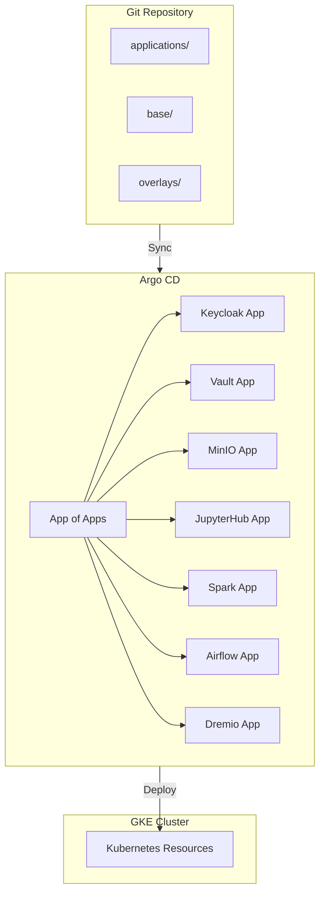
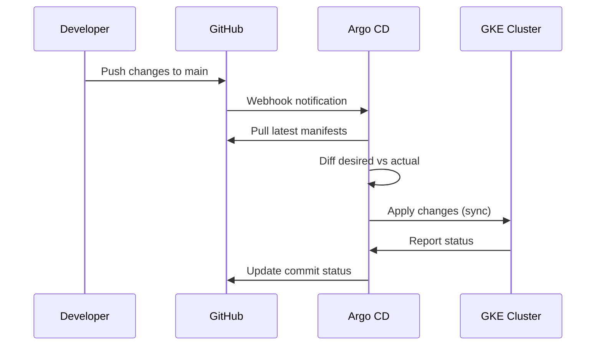

# GitOps Transformation Proposal

This document outlines the plan to transform the project from imperative scripts to a declarative GitOps architecture.

## Current State (Imperative)

- Shell scripts that run `kubectl apply`, `helm install`, `curl` commands
- Manual configuration via API calls (Keycloak realm setup, Vault OIDC config)
- Credentials generated at runtime and stored in local files

## Target State (Declarative GitOps)



---

## Proposed Directory Structure

```
├── applications/              # Argo CD Application definitions
│   ├── app-of-apps.yaml      # Root application
│   ├── keycloak.yaml
│   ├── vault.yaml
│   ├── minio.yaml
│   ├── jupyterhub.yaml
│   ├── spark.yaml
│   ├── airflow.yaml
│   └── dremio.yaml
│
├── base/                      # Base Kustomize configurations
│   ├── namespaces/
│   │   └── kustomization.yaml
│   ├── keycloak/
│   │   ├── kustomization.yaml
│   │   ├── operator.yaml
│   │   ├── postgres.yaml
│   │   ├── keycloak.yaml
│   │   └── realm-import.yaml  # Declarative realm config
│   ├── vault/
│   │   ├── kustomization.yaml
│   │   ├── vault-config.yaml  # Vault Operator CRs
│   │   └── oidc-config.yaml   # VaultAuth CRD
│   ├── minio/
│   │   ├── kustomization.yaml
│   │   ├── operator.yaml
│   │   └── tenant.yaml
│   ├── jupyterhub/
│   │   ├── kustomization.yaml
│   │   └── values.yaml
│   ├── spark/
│   │   ├── kustomization.yaml
│   │   └── operator.yaml
│   ├── airflow/
│   │   ├── kustomization.yaml
│   │   └── values.yaml
│   └── dremio/
│       ├── kustomization.yaml
│       └── values.yaml
│
├── overlays/                  # Environment-specific configs
│   ├── dev/
│   │   ├── kustomization.yaml
│   │   └── patches/
│   ├── staging/
│   │   └── ...
│   └── prod/
│       └── ...
│
├── sealed-secrets/            # Encrypted secrets (SealedSecrets/SOPS)
│   ├── keycloak-admin.yaml
│   ├── vault-keys.yaml
│   └── minio-credentials.yaml
│
└── docs/                      # Documentation (kept)
```

---

## Component Migration Plan

| Component | Current (Scripts) | GitOps (Declarative) |
|-----------|------------------|---------------------|
| **Namespaces** | `kubectl create ns` in scripts | `Namespace` manifests in `base/namespaces/` |
| **Keycloak Realm** | Curl API calls to create realm/clients/users | `KeycloakRealmImport` CRD (already supported) |
| **Vault Config** | `vault` CLI commands for OIDC setup | Vault Secrets Operator + `VaultAuth` CRD |
| **MinIO OIDC** | Inject env vars via script | ConfigMap + Tenant CRD with OIDC config |
| **Secrets** | Generated at runtime, stored locally | SealedSecrets or External Secrets Operator |
| **Helm Charts** | `helm install` in scripts | Argo CD `Application` with Helm source |

---

## Secrets Management Options

| Option | Pros | Cons |
|--------|------|------|
| **SealedSecrets** | Simple, works offline | Need kubeseal CLI, cluster-specific |
| **External Secrets Operator** | Multi-backend (Vault, GCP SM, AWS SM) | Requires external secret store |
| **SOPS + Age/GPG** | Git-native encryption | Key management overhead |
| **Vault + Injector** | Dynamic secrets, rotation | Complexity, Vault dependency |

**Recommendation**: External Secrets Operator with Vault as backend (since Vault is already deployed)

---

## Scripts Analysis

### Scripts to Remove

| Script | Replacement |
|--------|-------------|
| `deploy-gke.sh` | Argo CD Application for Keycloak + Vault |
| `deploy-minio-gke.sh` | Argo CD Application for MinIO |
| `deploy-jupyterhub-gke.sh` | Argo CD Application for JupyterHub |
| `deploy-spark-operator.sh` | Argo CD Application for Spark |
| `deploy-dremio-ee.sh` | Argo CD Application for Dremio |
| `list-users.sh` | Use Keycloak UI/API directly |
| `list-policies.sh` | Use MinIO Console directly |
| `lib/*.sh` | No longer needed |

### Scripts to Keep

| Script | Reason |
|--------|--------|
| `start-port-forwards.sh` | Local development utility |
| `show-access-info.sh` | Debugging utility |
| `get-minio-sts-credentials.sh` | Development utility |
| `cleanup-dremio-namespace.sh` | Emergency recovery |

---

## Deployment Flow (GitOps)



---

## Bootstrap Process

Only ONE manual step needed:

```bash
# Install Argo CD and apply the App of Apps
kubectl apply -k bootstrap/
```

Everything else syncs automatically from Git.

---

## Implementation Phases

| Phase | Scope | Effort |
|-------|-------|--------|
| **Phase 1** | Add Argo CD + App of Apps structure | 2-3 days |
| **Phase 2** | Convert Keycloak to declarative (RealmImport CRD) | 1-2 days |
| **Phase 3** | Add External Secrets Operator + Vault backend | 1-2 days |
| **Phase 4** | Convert remaining components (MinIO, JupyterHub, Spark, Dremio) | 2-3 days |
| **Phase 5** | Add overlays for dev/staging/prod | 1 day |
| **Phase 6** | Remove scripts, update docs | 1 day |

**Total Estimated Effort: 8-12 days**

---

## Keycloak Realm Import CRD Example

The Keycloak Operator supports declarative realm configuration:

```yaml
apiVersion: k8s.keycloak.org/v2alpha1
kind: KeycloakRealmImport
metadata:
  name: vault-realm
  namespace: operators
spec:
  keycloakCRName: keycloak
  realm:
    realm: vault
    enabled: true
    clients:
      - clientId: vault
        enabled: true
        clientAuthenticatorType: client-secret
        standardFlowEnabled: true
        directAccessGrantsEnabled: true
        redirectUris:
          - "http://localhost:8200/*"
          - "http://localhost:8250/*"
        webOrigins:
          - "+"
      - clientId: minio
        enabled: true
        # ... minio client config
      - clientId: jupyterhub
        enabled: true
        # ... jupyterhub client config
    groups:
      - name: vault-admins
      - name: minio-access
      - name: jupyterhub
    users:
      - username: admin
        enabled: true
        credentials:
          - type: password
            value: admin
            temporary: false
        groups:
          - vault-admins
          - minio-access
          - jupyterhub
```

---

## Vault Configuration with Vault Secrets Operator

```yaml
apiVersion: secrets.hashicorp.com/v1beta1
kind: VaultAuth
metadata:
  name: keycloak-oidc
  namespace: vault
spec:
  method: jwt
  mount: oidc
  jwt:
    role: admin
    audiences:
      - vault
    serviceAccount: default
---
apiVersion: secrets.hashicorp.com/v1beta1
kind: VaultStaticSecret
metadata:
  name: minio-credentials
  namespace: minio
spec:
  type: kv-v2
  mount: secret
  path: minio
  destination:
    name: minio-credentials
    create: true
```

---

## Argo CD Application Example

```yaml
apiVersion: argoproj.io/v1alpha1
kind: Application
metadata:
  name: keycloak
  namespace: argocd
spec:
  project: default
  source:
    repoURL: https://github.com/rammi-dev/dremio-platform1.git
    targetRevision: main
    path: base/keycloak
  destination:
    server: https://kubernetes.default.svc
    namespace: operators
  syncPolicy:
    automated:
      prune: true
      selfHeal: true
    syncOptions:
      - CreateNamespace=true
```

---

## App of Apps Pattern

```yaml
apiVersion: argoproj.io/v1alpha1
kind: Application
metadata:
  name: platform
  namespace: argocd
spec:
  project: default
  source:
    repoURL: https://github.com/rammi-dev/dremio-platform1.git
    targetRevision: main
    path: applications
  destination:
    server: https://kubernetes.default.svc
    namespace: argocd
  syncPolicy:
    automated:
      prune: true
      selfHeal: true
```

---

## Decision Points

Before implementation, decisions needed on:

1. **GitOps Tool**: Argo CD vs Flux CD
   - Recommendation: Argo CD (better UI, more features)

2. **Secrets Management**: SealedSecrets vs External Secrets Operator vs SOPS
   - Recommendation: External Secrets Operator with Vault backend

3. **Environments**: Number of overlays needed
   - Suggested: dev, staging, prod

4. **Vault Configuration**: Vault Secrets Operator vs manual config
   - Recommendation: Vault Secrets Operator for full GitOps

5. **Branch Strategy**: GitFlow vs trunk-based
   - Recommendation: Trunk-based with environment branches

---

## Benefits of GitOps

| Benefit | Description |
|---------|-------------|
| **Declarative** | Desired state in Git, not imperative commands |
| **Versioned** | Full history of all changes |
| **Auditable** | Git commits provide audit trail |
| **Reproducible** | Same config deploys same infrastructure |
| **Self-healing** | Argo CD detects and corrects drift |
| **Multi-environment** | Overlays for dev/staging/prod |
| **Rollback** | Git revert to rollback changes |
| **PR-based workflow** | Review infrastructure changes like code |

---

## Next Steps

1. Review and approve this proposal
2. Decide on secrets management approach
3. Create new branch for GitOps implementation
4. Implement Phase 1 (Argo CD + App of Apps)
5. Iteratively migrate components
6. Test in dev environment
7. Remove legacy scripts
8. Update documentation
