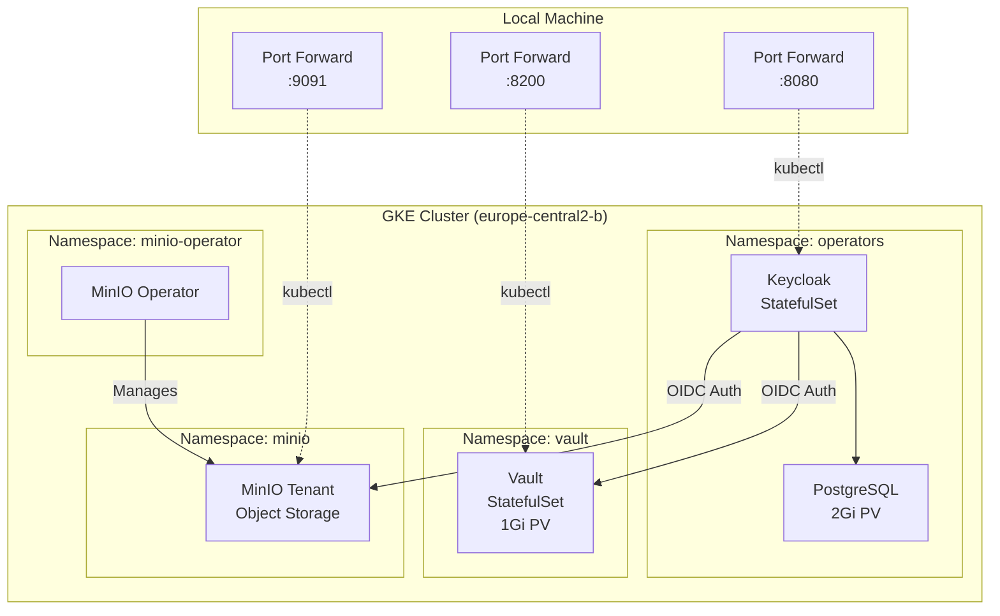

# GKE Deployment Plan: Keycloak + Vault + MinIO

## Overview

Your project is a production-ready deployment platform for **Keycloak** (identity management), **HashiCorp Vault** (secrets management), and **MinIO** (object storage) with full OIDC integration. The platform supports both Minikube (local) and GKE (cloud) deployments.

### Current Status
- **GKE Cluster**: `data-cluster-gke1` in `europe-central2-b`
- **Cluster Status**: ✅ Running (1 node, fresh installation)
- **Namespaces**: Only system namespaces (no application deployments yet)

---

## Architecture



---

## Deployment Sequence

### Phase 1: Deploy Keycloak & Vault

**Script**: [`deploy-gke.sh`](file:///home/rami/Work/dremio-platform1/scripts/deploy-gke.sh)

This script performs the following:

1. **Verify GKE Connection** - Checks kubectl is configured for GKE
2. **Create Namespaces** - `operators`, `keycloak`, `vault`
3. **Deploy Keycloak Operator** - Installs operator in `operators` namespace
4. **Deploy PostgreSQL** - StatefulSet with 2Gi persistent volume for Keycloak data
5. **Deploy Keycloak Instance** - Waits for pod `keycloak-0` to be ready
6. **Deploy Vault** - Helm chart with 1Gi persistent volume
7. **Initialize Vault** - Creates `config/vault-keys.json` with root token and unseal key
8. **Unseal Vault** - Unseals Vault using the generated key
9. **Start Port-Forwards** - Keycloak (8080) and Vault (8200)
10. **Configure Keycloak** - Creates `vault` realm, OIDC client, admin user, and groups
11. **Configure Vault OIDC** - Enables OIDC auth method pointing to Keycloak

**Expected Duration**: ~5-7 minutes

**Outputs**:
- `config/vault-keys.json` - Vault root token and unseal key
- `config/keycloak-vault-client-secret.txt` - OIDC client secret

---

### Phase 2: Deploy MinIO

**Script**: [`deploy-minio-gke.sh`](file:///home/rami/Work/dremio-platform1/scripts/deploy-minio-gke.sh)

This script performs the following:

1. **Check Keycloak Status** - Verifies Keycloak is running
2. **Authenticate with Keycloak** - Gets admin access token
3. **Configure Keycloak Client** - Creates/updates `minio` OIDC client
4. **Configure RBAC** - Creates `minio-access` group and adds admin user
5. **Deploy MinIO Operator** - Installs operator in `minio-operator` namespace
6. **Deploy MinIO Tenant** - Creates MinIO instance in `minio` namespace
7. **Configure OIDC** - Injects OIDC configuration into MinIO
8. **Store Credentials in Vault** - Saves MinIO credentials to Vault
9. **Create MinIO Policy** - Creates `minio-access` policy for bucket access
10. **Start Port-Forward** - MinIO Console (9091)

**Expected Duration**: ~3-5 minutes

---

## Deployment Commands

### Step 1: Deploy Keycloak & Vault

```bash
cd /home/rami/Work/dremio-platform1
./scripts/deploy-gke.sh
```

**What to expect**:
- Script will create all namespaces and deploy components
- Keycloak will take ~2-3 minutes to become ready
- Vault will be initialized and unsealed automatically
- Port-forwards will start in the background
- Credentials will be saved to `config/` directory

### Step 2: Deploy MinIO

```bash
./scripts/deploy-minio-gke.sh
```

**What to expect**:
- MinIO Operator will be installed
- MinIO Tenant will be deployed with OIDC configuration
- MinIO pods will restart to apply OIDC settings
- Port-forward will start for MinIO Console

---

## Verification Plan

### 1. Verify Cluster Resources

```bash
# Check all namespaces
kubectl get namespaces

# Expected: operators, keycloak, vault, minio, minio-operator

# Check all pods
kubectl get pods -A

# Expected pods:
# - operators/keycloak-0 (Running)
# - operators/postgres-* (Running)
# - vault/vault-0 (Running)
# - minio-operator/minio-operator-* (Running)
# - minio/minio-* (Running)
```

### 2. Verify Persistent Volumes

```bash
# Check PVCs
kubectl get pvc -A

# Expected:
# - operators/postgres-pvc (2Gi, Bound)
# - vault/vault-data-vault-0 (1Gi, Bound)
```

### 3. Verify Port-Forwards

```bash
# Check running port-forwards
ps aux | grep "kubectl port-forward"

# Expected:
# - port-forward -n operators svc/keycloak-service 8080:8080
# - port-forward -n vault svc/vault-ui 8200:8200
# - port-forward -n minio svc/minio-console 9091:9443
```

### 4. Test Keycloak Access

**Master Realm (Admin Console)**:
```bash
# Get credentials
KEYCLOAK_USER=$(kubectl get secret keycloak-initial-admin -n operators -o jsonpath='{.data.username}' | base64 -d)
KEYCLOAK_PASS=$(kubectl get secret keycloak-initial-admin -n operators -o jsonpath='{.data.password}' | base64 -d)

echo "Username: $KEYCLOAK_USER"
echo "Password: $KEYCLOAK_PASS"

# Test API access
curl -s -X POST "http://localhost:8080/realms/master/protocol/openid-connect/token" \
  -H "Content-Type: application/x-www-form-urlencoded" \
  -d "username=$KEYCLOAK_USER" \
  -d "password=$KEYCLOAK_PASS" \
  -d "grant_type=password" \
  -d "client_id=admin-cli" | jq -r .access_token
```

**Expected**: Should return a JWT access token

**Vault Realm (Application Users)**:
```bash
# Test admin user login
curl -s -X POST "http://localhost:8080/realms/vault/protocol/openid-connect/token" \
  -H "Content-Type: application/x-www-form-urlencoded" \
  -d "username=admin" \
  -d "password=admin" \
  -d "grant_type=password" \
  -d "client_id=vault" \
  -d "client_secret=$(cat config/keycloak-vault-client-secret.txt)" | jq
```

**Expected**: Should return tokens with `groups: ["vault-admins"]`

### 5. Test Vault Access

**Root Token Login**:
```bash
# Get root token
ROOT_TOKEN=$(jq -r '.root_token' config/vault-keys.json)

# Test Vault API
curl -s -H "X-Vault-Token: $ROOT_TOKEN" http://localhost:8200/v1/sys/health | jq
```

**Expected**: Should return `{"initialized": true, "sealed": false}`

**OIDC Login** (Manual Browser Test):
1. Open http://localhost:8200
2. Select "OIDC" as auth method
3. Enter role: `admin`
4. Click "Sign in with OIDC"
5. Login with `admin` / `admin`

**Expected**: Should redirect to Vault UI with full access

### 6. Test MinIO Access

**MinIO Console** (Manual Browser Test):
1. Open http://localhost:9091
2. Click "Login with OpenID"
3. Login with `admin` / `admin` (Keycloak credentials)

**Expected**: Should redirect to MinIO Console

**MinIO API**:
```bash
# Get MinIO credentials from Vault
ROOT_TOKEN=$(jq -r '.root_token' config/vault-keys.json)
kubectl exec -n vault vault-0 -- vault login $ROOT_TOKEN > /dev/null
kubectl exec -n vault vault-0 -- vault kv get -format=json secret/minio | jq -r .data.data
```

**Expected**: Should return MinIO access_key and secret_key

### 7. Test OIDC Integration

**Verify Keycloak Groups**:
```bash
# Get admin user groups
KEYCLOAK_USER=$(kubectl get secret keycloak-initial-admin -n operators -o jsonpath='{.data.username}' | base64 -d)
KEYCLOAK_PASS=$(kubectl get secret keycloak-initial-admin -n operators -o jsonpath='{.data.password}' | base64 -d)

TOKEN=$(curl -s -X POST "http://localhost:8080/realms/master/protocol/openid-connect/token" \
  -H "Content-Type: application/x-www-form-urlencoded" \
  -d "username=$KEYCLOAK_USER" \
  -d "password=$KEYCLOAK_PASS" \
  -d "grant_type=password" \
  -d "client_id=admin-cli" | jq -r .access_token)

curl -s -H "Authorization: Bearer $TOKEN" \
  "http://localhost:8080/admin/realms/vault/users?username=admin" | jq '.[0].groups'
```

**Expected**: Should show `vault-admins` and `minio-access` groups

---

## Testing Checklist

### Pre-Deployment Checks
- [ ] GKE cluster is running and accessible
- [ ] kubectl is configured for the correct cluster
- [ ] Sufficient cluster resources (at least 1 node with 4GB+ memory)

### Post-Deployment Checks (Phase 1)
- [ ] All namespaces created (`operators`, `keycloak`, `vault`)
- [ ] Keycloak pod is running (`keycloak-0`)
- [ ] PostgreSQL pod is running
- [ ] Vault pod is running (`vault-0`)
- [ ] Vault is initialized and unsealed
- [ ] Port-forwards are active (8080, 8200)
- [ ] `config/vault-keys.json` exists
- [ ] `config/keycloak-vault-client-secret.txt` exists
- [ ] Keycloak master realm is accessible
- [ ] Keycloak vault realm exists with admin user
- [ ] Vault OIDC auth is configured

### Post-Deployment Checks (Phase 2)
- [ ] MinIO Operator is running
- [ ] MinIO Tenant pods are running
- [ ] MinIO Console port-forward is active (9091)
- [ ] MinIO OIDC configuration is applied
- [ ] MinIO credentials are stored in Vault
- [ ] `minio-access` group exists in Keycloak
- [ ] Admin user is member of `minio-access` group

### Functional Tests
- [ ] Can login to Keycloak master realm
- [ ] Can login to Keycloak vault realm as admin/admin
- [ ] Can login to Vault UI with root token
- [ ] Can login to Vault UI via OIDC (admin/admin)
- [ ] Can login to MinIO Console via OIDC (admin/admin)
- [ ] Can retrieve MinIO credentials from Vault
- [ ] Can create buckets in MinIO
- [ ] Can upload/download files in MinIO

### Data Persistence Tests
- [ ] PostgreSQL PVC is bound (2Gi)
- [ ] Vault PVC is bound (1Gi)
- [ ] Keycloak data persists after pod restart
- [ ] Vault data persists after pod restart

---

## Access Summary

| Service | URL | Credentials | Purpose |
|---------|-----|-------------|---------|
| **Keycloak Master** | http://localhost:8080 | `temp-admin` / *dynamic* | Admin console |
| **Keycloak Vault Realm** | http://localhost:8080/realms/vault | `admin` / `admin` | Application users |
| **Vault UI (Root)** | http://localhost:8200 | Root token from `config/vault-keys.json` | Admin access |
| **Vault UI (OIDC)** | http://localhost:8200 | Method=OIDC, Role=`admin`, then `admin`/`admin` | User access |
| **MinIO Console** | http://localhost:9091 | Click "Login with OpenID" → `admin`/`admin` | Object storage |

---

## Troubleshooting

### Port-Forwards Not Working
```bash
# Kill existing port-forwards
pkill -f "kubectl port-forward"

# Restart them manually
# Restart them manually
kubectl port-forward -n operators svc/keycloak-service 8080:8080 --address=0.0.0.0 &
kubectl port-forward -n vault svc/vault-ui 8200:8200 --address=0.0.0.0 &
# Use 0.0.0.0 and nohup for persistence
nohup kubectl port-forward -n minio svc/minio-console 9091:9443 --address=0.0.0.0 > /dev/null 2>&1 &
```

### Vault is Sealed
```bash
# Unseal Vault
UNSEAL_KEY=$(jq -r '.unseal_keys_b64[0]' config/vault-keys.json)
kubectl exec -n vault vault-0 -- vault operator unseal $UNSEAL_KEY
```

### MinIO OIDC Not Working
```bash
# Check MinIO configuration
kubectl get secret -n minio -o jsonpath='{.items[?(@.data.config\.env)].metadata.name}'
kubectl get secret <secret-name> -n minio -o jsonpath='{.data.config\.env}' | base64 -d | grep OIDC

# Restart MinIO pods
kubectl delete pod -n minio -l v1.min.io/tenant=minio
```

### Check Logs
```bash
# Keycloak logs
kubectl logs -n operators keycloak-0 -f

# Vault logs
kubectl logs -n vault vault-0 -f

# MinIO logs
kubectl logs -n minio -l v1.min.io/tenant=minio -f
```

---

## Next Steps After Deployment

1. **Test OIDC Login Flow** - Verify all three services accept Keycloak authentication
2. **Create MinIO Buckets** - Test object storage functionality
3. **Configure Vault Policies** - Set up fine-grained access control
4. **Backup Credentials** - Save `config/vault-keys.json` securely
5. **Monitor Resources** - Check pod resource usage and adjust if needed

---

## Important Notes

> [!IMPORTANT]
> - **Credentials Location**: All generated credentials are in the `config/` directory (gitignored)
> - **Vault Keys**: The `config/vault-keys.json` file is critical - without it, you cannot unseal Vault
> - **Port-Forwards**: Run in background - use `pkill -f "kubectl port-forward"` to stop them

> [!WARNING]
> - **Default Passwords**: The `admin/admin` credentials are for testing only - change in production
> - **HTTPS**: MinIO Console uses self-signed certificates - browser will show security warning
> - **Network Access**: Port-forwards bind to localhost/0.0.0.0 - adjust `--address` for security

> [!CAUTION]
> - **GKE Costs**: Remember to delete the cluster when done to avoid charges
> - **Data Loss**: Deleting the cluster will delete all persistent volumes and data
