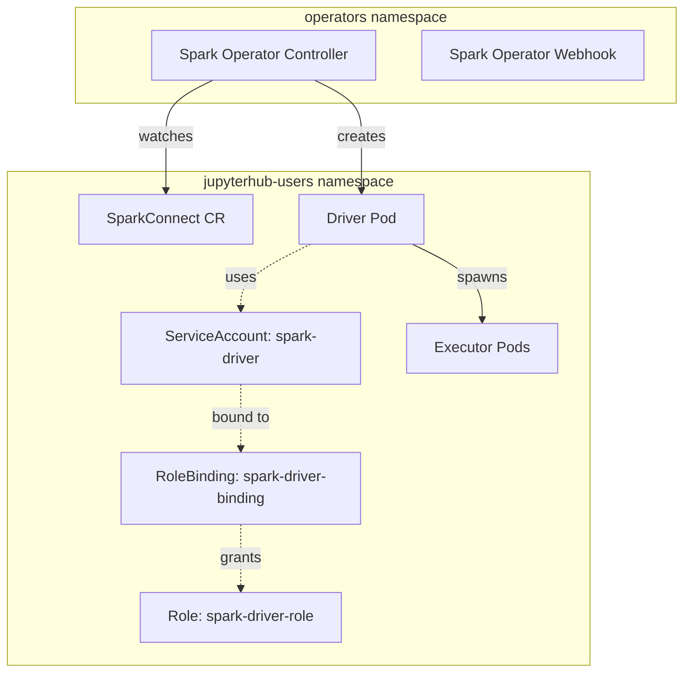

# Spark Platform - Detailed Documentation

## Table of Contents
- [Architecture Overview](#architecture-overview)
- [RBAC Configuration](#rbac-configuration)
- [Deployment Logic](#deployment-logic)
- [Known Issues & Workarounds](#known-issues--workarounds)
- [Troubleshooting](#troubleshooting)

## Architecture Overview

### Component Topology



### Namespace Separation

**Why two namespaces?**
- `operators`: Centralized control plane for cluster-wide Spark management
- `jupyterhub-users`: Isolated execution environment for user workloads

This separation follows the **operator pattern** where:
1. Operators run with elevated privileges in a dedicated namespace
2. User workloads run with minimal permissions in their own namespace
3. RBAC strictly controls what the operator can do in user namespaces

## RBAC Configuration

### ServiceAccount: `spark-driver`

The Spark driver pod runs as this ServiceAccount, which needs permissions to:
- Create and manage executor pods
- Create services for driver-executor communication
- Create ConfigMaps for Spark configuration
- Monitor pod lifecycle via events

### Role: `spark-driver-role`

```yaml
rules:
- apiGroups: [""]
  resources: ["pods", "services", "configmaps", "persistentvolumeclaims", "events"]
  verbs: ["create", "get", "list", "watch", "delete"]
```

**Why these permissions?**

| Resource | Verbs | Reason |
|----------|-------|--------|
| `pods` | create, delete, get, list, watch | Driver spawns/terminates executor pods dynamically |
| `services` | create, delete, get | Driver creates headless services for executor discovery |
| `configmaps` | create, delete, get | Stores executor pod templates and Spark configuration |
| `persistentvolumeclaims` | create, delete, get, list | For dynamic volume provisioning (if enabled) |
| `events` | create, get, list, watch | Logging and debugging pod lifecycle |

**Security Note**: These permissions are scoped to the `jupyterhub-users` namespace only via the RoleBinding (not ClusterRoleBinding).

### RoleBinding: `spark-driver-binding`

Binds the `spark-driver` ServiceAccount to the `spark-driver-role` within the `jupyterhub-users` namespace.

## Deployment Logic

### Helm Chart Structure

```
helm/spark/
├── Chart.yaml              # Dependency on upstream spark-operator chart
├── values.yaml             # Configuration overrides
├── templates/
│   └── user-rbac.yaml     # RBAC resources for jupyterhub-users namespace
└── examples/
    └── spark-connect-server.yaml  # Validated SparkConnect application
```

### Deployment Flow

1. **Dependency Resolution** (`helm dependency build`)
   - Downloads `spark-operator` chart v2.4.0 from Kubeflow repository
   - Stores in `charts/` subdirectory

2. **Operator Installation** (`helm upgrade --install`)
   - Deploys operator controller and webhook to `operators` namespace
   - Configures operator to watch `jupyterhub-users` namespace via `spark.jobNamespaces`
   - Installs CRDs: `SparkApplication`, `SparkConnect`, `ScheduledSparkApplication`

3. **RBAC Provisioning** (via Helm template)
   - Creates `spark-driver` ServiceAccount in `jupyterhub-users`
   - Creates Role with minimal required permissions
   - Binds ServiceAccount to Role

4. **Application Deployment** (manual step)
   - User applies SparkConnect CR from `examples/`
   - Operator reconciles and creates driver pod
   - Driver pod spawns executor pods

### Why Helm Dependencies?

Using Helm dependencies instead of direct installation provides:
- **Version pinning**: Explicit control over operator version
- **Value overrides**: Centralized configuration in our `values.yaml`
- **Lifecycle management**: Single `helm uninstall` removes everything
- **Reproducibility**: `helm dependency build` ensures consistent deployments

## Known Issues & Workarounds

### GKE Node Filesystem Corruption

**Symptom**: Pods fail with `no space left on device` during volume mounting, despite node showing available disk space.

**Root Cause**: 
```bash
kubectl describe node <node-name>
# Shows: Warning  ReadOnlyFileSystemDetected  ... device-fs-monitor
```

The node's filesystem is corrupted or experiencing inode exhaustion, causing specific write operations to fail.

**Why Limits Trigger the Issue**:
- Setting CPU/Memory `limits` requires Kubelet to write cgroup configuration files
- On a corrupted filesystem, these writes fail with "no space" or "read-only" errors
- Setting only `requests` uses a lighter-weight scheduling mechanism that bypasses the failing write path

**QoS Class Behavior**:

| Configuration | QoS Class | Result on Broken Node |
|---------------|-----------|----------------------|
| requests == limits | Guaranteed | ❌ Fails (cgroup creation fails) |
| requests < limits | Burstable | ❌ Fails (cgroup limits still enforced) |
| requests only | Burstable | ✅ Works (no strict cgroup limits) |
| No requests/limits | BestEffort | ✅ Works (no cgroup enforcement) |

**Workaround Applied in Examples**:

```yaml
resources:
  requests:
    cpu: 500m
    memory: 512m
  # limits: REMOVED - would trigger node failure
```

**Additional Workarounds in SparkConnect Example**:

1. **Memory-backed Ivy Cache**:
   ```yaml
   volumes:
   - name: ivy-cache
     emptyDir:
       medium: Memory  # Avoids disk writes for Maven dependency cache
       sizeLimit: "512Mi"
   ```

2. **Explicit fsGroup**:
   ```yaml
   securityContext:
     fsGroup: 185  # Ensures Spark user can write to emptyDir
     runAsUser: 185
   ```

**Permanent Fix**: Replace or repair the affected GKE node.

## Troubleshooting

### Operator Not Creating Pods

**Check operator logs**:
```bash
kubectl logs -n operators -l app.kubernetes.io/name=spark-operator --tail=50
```

**Common issues**:
- Namespace not in `jobNamespaces` list
- ServiceAccount doesn't exist
- RBAC permissions missing

### Driver Pod Stuck in ContainerCreating

**Check events**:
```bash
kubectl get events -n jupyterhub-users --field-selector involvedObject.name=<pod-name> --sort-by=.lastTimestamp
```

**If you see `FailedMount: no space left on device`**:
- Verify node health: `kubectl describe node <node-name>`
- Check for `ReadOnlyFileSystemDetected` warnings
- Apply workaround: remove resource limits

### Executor Pods Not Spawning

**Verify driver RBAC**:
```bash
kubectl auth can-i create pods --as=system:serviceaccount:jupyterhub-users:spark-driver -n jupyterhub-users
```

Should return `yes`. If not, check RoleBinding.

### SparkConnect ClassNotFoundException

**Symptom**: Driver logs show `java.lang.ClassNotFoundException: org.apache.spark.sql.connect.service.SparkConnectServer`

**Solution**: Add to SparkConnect spec:
```yaml
spec:
  sparkConf:
    "spark.jars.packages": "org.apache.spark:spark-connect_2.12:3.5.0"
```

### Ivy Cache Permission Denied

**Symptom**: `FileNotFoundException: /home/spark/.ivy2/cache/... (Permission denied)`

**Solution**: Mount memory-backed emptyDir and set fsGroup:
```yaml
spec:
  server:
    template:
      spec:
        securityContext:
          fsGroup: 185
        volumes:
        - name: ivy-cache
          emptyDir:
            medium: Memory
```

## References

- [Kubeflow Spark Operator Documentation](https://github.com/kubeflow/spark-operator)
- [Spark on Kubernetes Guide](https://spark.apache.org/docs/latest/running-on-kubernetes.html)
- [Kubernetes QoS Classes](https://kubernetes.io/docs/tasks/configure-pod-container/quality-service-pod/)
